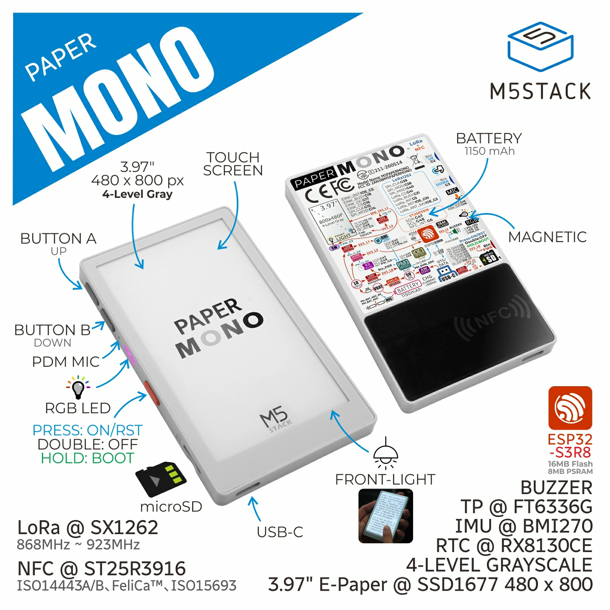
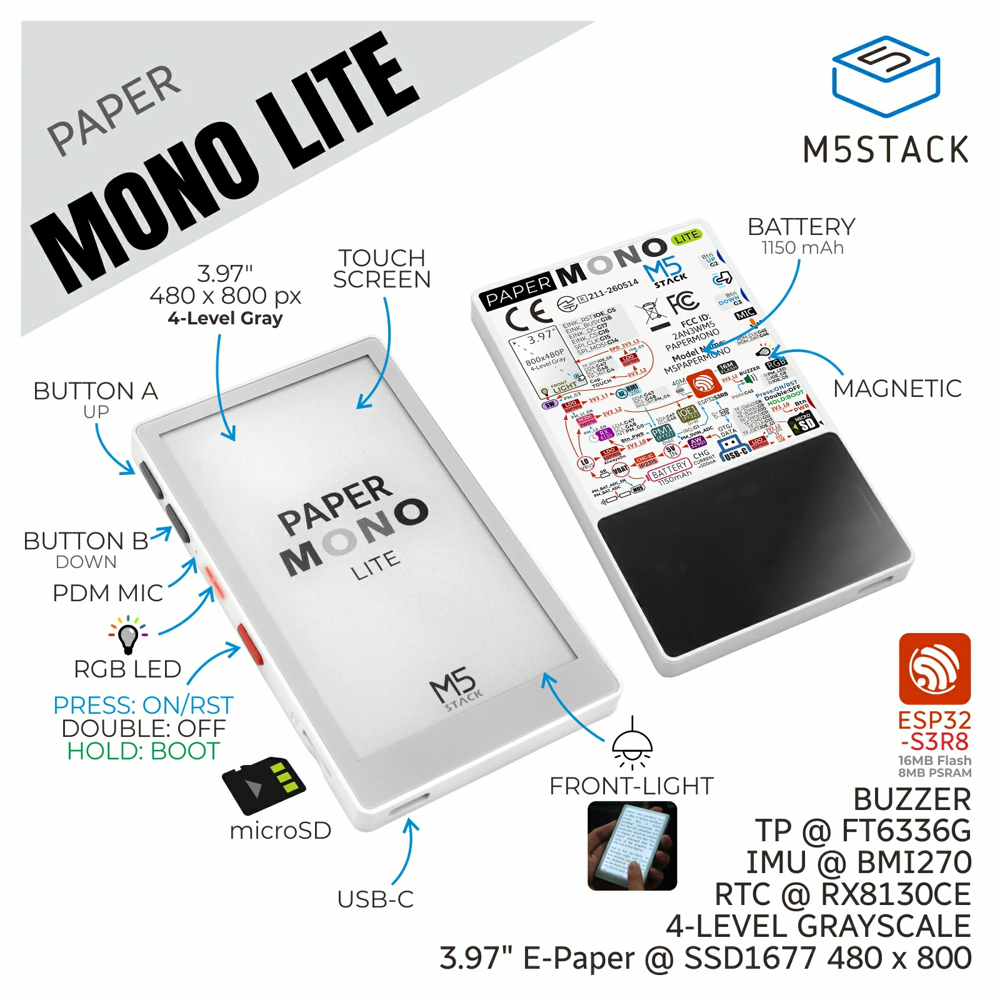

# Enclosure layout

Where holes and keys sit on the card. Electrical nets stay in
[pin-map.md](pin-map.md). Product photos are vendored under
[resources/enclosure/](../resources/enclosure/SOURCE.md)
(PNG for reading; WebP is the upstream bytes).

Official size: 62.0 × 101.0 × 8.0 mm. Full SKU 74.7 g; Lite
72.4 g. Older product PDF rows said “work in progress” / 61 mm —
name that in [sources.md](sources.md); prefer the current HTML
tables.

Gray case = PaperMono (`C153`). White case = PaperMono-Lite
(`C153-Lite`).

## Front (e-paper panel)

The large rectangle is the **e-paper panel** (SSD1677, 3.97",
480×800, 4-gray) with FT6336G capacitive touch under the
cover. Frontlight is integrated. Touching the panel is not
BUTTON A / BUTTON B.

Active area (official): X 5–475 of 480, Y 5–795 of 800.
[nyc-ft6336-area](../resources/not-yet-confirmed.md#nyc-ft6336-area).

## Keys and power

Photo callouts (both SKUs), top to bottom on the side that
has the two black keys:

| Photo label | What it is |
| --- | --- |
| **BUTTON A (UP)** | Upper black key. PinMap `USER_KEY1`, GPIO2 |
| **BUTTON B (DOWN)** | Lower black key. PinMap `USER_KEY2`, GPIO3 (strap) |
| PDM MIC | Mic hole (not a key) |
| RGB LED | Side LED |
| Red button | Power: PRESS ON/RST, DOUBLE OFF, HOLD BOOT |

The two black keys have **no** KEY1 / KEY2 print on the
plastic. Use the photo names when talking to an operator.
GPIO numbers stay the PinMap table, not the back-sticker
text.

## Default test orientation (`C153-Lite`, operator)

E-paper facing the human. USB-C cable **down**. Buttons, PDM
mic, and microSD slot on the **left**. Same as the vendored
photos.

In that hold, top to bottom on the left edge:

1. **BUTTON A (UP)** — upper black key (away from USB-C)
2. **BUTTON B (DOWN)** — lower black key
3. PDM mic hole
4. RGB LED
5. Red power (PRESS ON/RST, DOUBLE OFF, HOLD BOOT)

microSD is the slot on the bottom-left of this hold, USB-C
centered on the bottom edge.

**Lite (`C153-Lite`, 2026-09-01):** in that hold, upper black
key (BUTTON A) is GPIO2; lower (BUTTON B) is GPIO3. Idle is
high (`1`); press is low (`0`). `C153` not measured.
[nyc-enclosure-edges](../resources/not-yet-confirmed.md#nyc-enclosure-edges).

Official: 2 user buttons + 1 power button (ON / OFF / RESET /
BOOT). Short press = on/reset. Double press = off. Hold ~2 s
until red LED blinks = download mode.

**Lite (`C153-Lite`, 2026-09-02):** those three gestures
match. Short ~0.25 s resets. Hold ~2 s to first blink
(small red, not RGB). Double-press off with USB unplugged
(gap too short to time). `C153` still
[nyc-power-button](../resources/not-yet-confirmed.md#nyc-power-button).

RGB LED is on the **side** of the body (official). Red is
`LED_EN_PP` (not PWM). Green/blue are M5IOE1 PWM.

**Lite (`C153-Lite`, 2026-09-02):** operator also sees a
tiny **rear-window** LED that stays red while USB is
charging. It did not change color during the gated charge
read. That is the charger lamp, not the side RGB.
[nyc-charge-stat](../resources/not-yet-confirmed.md#nyc-charge-stat).

## What this drawing is not

- Not a pinout. GPIO numbers come from official tables
  ([pin-map.md](pin-map.md)), not from the photo.
- Not a schematic. Walk
  `papermono-schematic` /
  `papermono-lite-schematic` in
  [datasheets.md](../resources/datasheets.md).
- Not permission to invent a fourth key or a Sticky-style
  right-edge triple.
