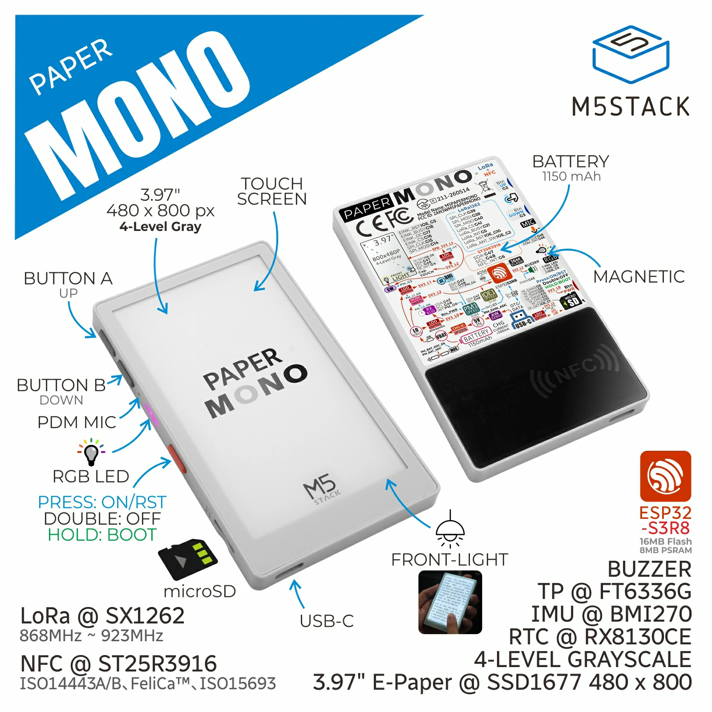
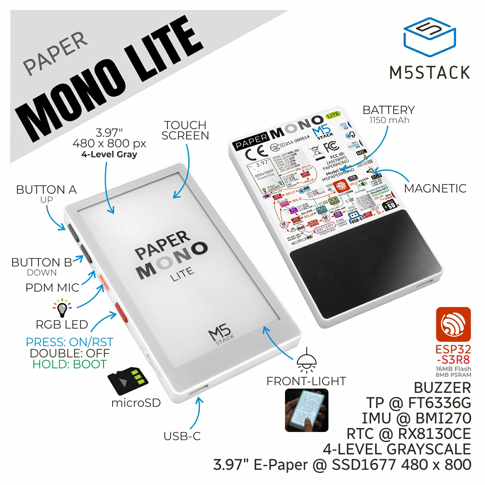

# Enclosure layout

Where holes and keys sit on the card. Electrical nets stay in
[pin-map.md](pin-map.md). Product photos are vendored under
[resources/enclosure/](../resources/enclosure/SOURCE.md).

**No unit was handled for this page.** Edge assignment vs the
photos is
[nyc-enclosure-edges](../resources/not-yet-confirmed.md#nyc-enclosure-edges).

Official size: 62.0 × 101.0 × 8.0 mm. Full SKU 74.7 g; Lite
72.4 g. Older product PDF rows said “work in progress” / 61 mm —
name that in [sources.md](sources.md); prefer the current HTML
tables.

Gray case = PaperMono (`C153`). White case = PaperMono-Lite
(`C153-Lite`).

## Front (glass)

The large rectangle is the **e-paper panel** with FT6336G
capacitive touch under the glass. Frontlight is integrated.
Touching glass is not KEY1/KEY2.

Active area (official): X 5–475 of 480, Y 5–795 of 800.
[nyc-ft6336-area](../resources/not-yet-confirmed.md#nyc-ft6336-area).

## Keys and power

Official: 2 user buttons + 1 power button (ON / OFF / RESET /
BOOT). Short press = on/reset. Double press = off. Hold ~2 s
until red LED blinks = download mode.

Which physical edge is power vs A vs B vs USB-C vs SD is not
closed. Write the answer in this file when
[nyc-enclosure-edges](../resources/not-yet-confirmed.md#nyc-enclosure-edges)
runs.

RGB LED is on the **side** of the body (official). Red is
`LED_EN_PP` (not PWM). Green/blue are M5IOE1 PWM.

## What this drawing is not

- Not a pinout. GPIO numbers come from official tables
  ([pin-map.md](pin-map.md)), not from the photo.
- Not a schematic. Walk
  `papermono-schematic` /
  `papermono-lite-schematic` in
  [datasheets.md](../resources/datasheets.md).
- Not permission to invent a fourth key or a Sticky-style
  right-edge triple.
