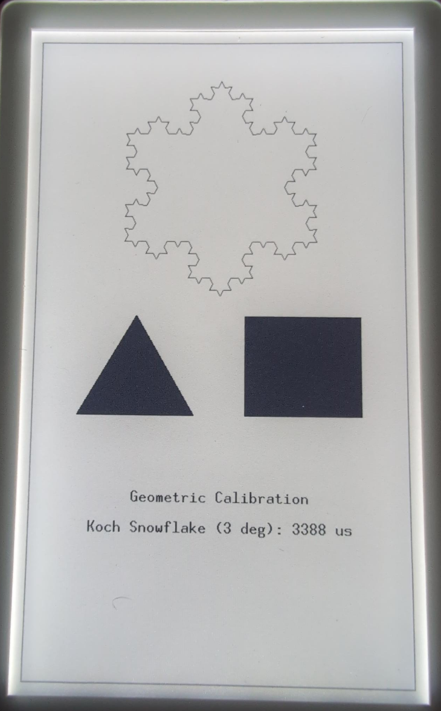
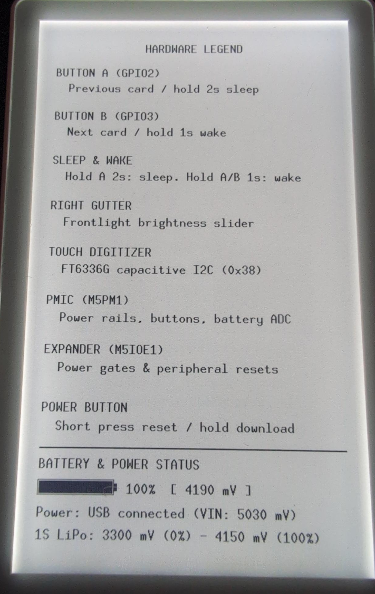
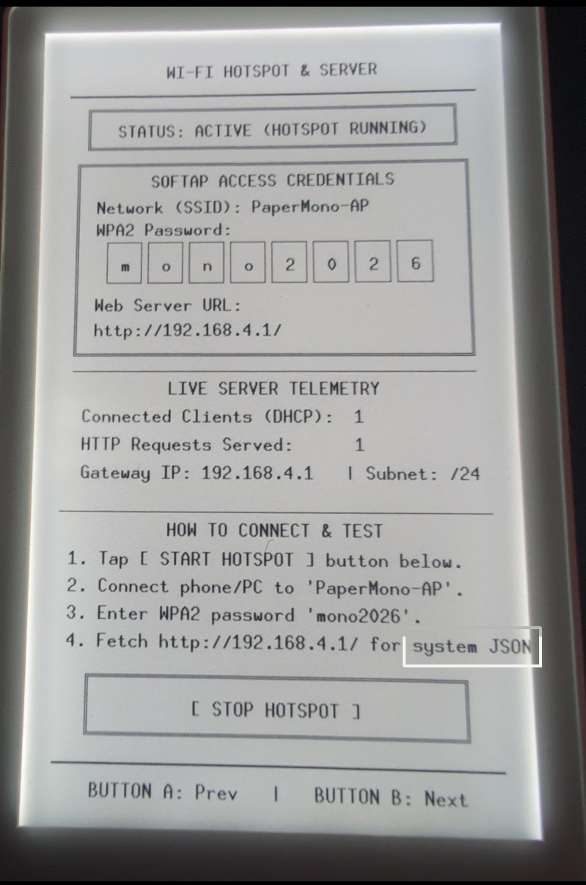

# `papermono-rs`

> [!IMPORTANT]
> This repository is not currently stable, and is being built as we
> confirm hardware capabilities and code.

Embedded Rust tooling and crates for the
[M5Stack PaperMono](https://docs.m5stack.com/en/core/PaperMono) and
[PaperMono-Lite](https://docs.m5stack.com/en/core/PaperMono-Lite).

The board contract and a safety-first host CLI (`cargo xtask`)
are here. Board crates:
`m5stack-papermono-lite` (`C153-Lite`, shared map) and
`m5stack-papermono` (`C153`, NFC + LoRa).
`simple-debug-fw` and `embassy-debug-fw` are workspace members,
not default-members.

- Host tools are: `cargo xtask` over `host/papermono-host`.
- **Read [docs/SAFETY.md](docs/SAFETY.md) before flashing or
  probing a unit.** A mistake can damage the panel (DC imbalance
  / invented LUTs), hang the system I2C bus (IP2315), or lose
  per-unit PHY calibration.
- **[Getting started](docs/getting-started.md)** (host verify, Xtensa,
  firmware install & run).
- [Snapshot HOWTO](docs/firmware-snapshot-management.md).
  Snapshot that unit before the first custom image if you care
  about PHY cal.
- [Hardware details](.agents/skills/m5stack-papermono-hardware/SKILL.md).
  Pin map, rails, SKU differences, datasheet cache.
- Open measurements:
  [not-yet-confirmed.md](docs/not-yet-confirmed.md)
  (`nyc-*`). Name PaperMono (`C153`) vs PaperMono-Lite
  (`C153-Lite`).
- Crate verdicts: [docs/CRATES.md](docs/CRATES.md).
- Other docs live in [`docs/`](./docs).
  `docs/SAFETY.md`, `docs/DATASHEETS.md`, and
  `docs/not-yet-confirmed.md` are symlinks into the hardware
  skill.

## Hardware Verification

Hardware features not yet measured on physical devices remain
documented vendor intent. The open measurement list is tracked
in [`nyc-*`](docs/not-yet-confirmed.md). Consult the
[tool verification ledger](docs/firmware-snapshot-management.md#tool-verification-ledger)
before treating a command as verified on target hardware.

### PaperMono + PaperMono-Lite Setup

The firmware ecosystem provides a unified, safe-by-default architecture
that auto-detects board hardware at startup and operates both PaperMono
(`C153`) and PaperMono-Lite (`C153-Lite`):

1. **Unified Default Binary**: The default firmware image includes full
   peripherals and dynamic board profile detection (`BoardModel`). At boot,
   the firmware probes ST25R3916 NFC IC identity at I2C address `0x50`
   (matching the official `M5PaperMono-UserDemo` `Hal::detectBoardVariant`
   hardware discriminator):
   - When detected (`C153`), the system initializes LoRa SPI and the full
     11-card UI carousel (`Splash`, `LoraScan`, `Lora`, `Nfc`, `WifiAp`,
     `WifiSurvey`, `Bluetooth`, `Legend`, `Shapes`, `Tones`, `Targets`).
   - When unpopulated or NAK (`C153-Lite`), the board model is set to
     `PaperMonoLite`. All radio initialization is safely bypassed, leaving
     unpopulated radio GPIOs completely quiescent and floating. The UI
     carousel automatically skips NFC and LoRa cards, presenting an 8-card
     flow without unpopulated features.
2. **Hardware Safety**:
   - Radio test pads and unpopulated nets on `C153-Lite` stay undriven,
     avoiding back-powering unpopulated silicon or driving floating pins.
   - The ST25R3916 NFC field is energized only during deliberate
     user-initiated polling and is powered down immediately when idle.
   - The SX1262 LoRa module operates with internal LDO regulation, hardware
     over-current protection (OCP 60 mA), +14 dBm bench-safe TX power, and
     an active antenna switch (`PYG2`) engaged only when the transceiver is
     powered.
3. **Compile-Time Pruning**: For users desiring minimal binary footprint or
   strictly verified Lite-only builds, passing
   `--no-default-features --features lite` completely compiles out all
   `C153` radio driver crates and dependencies at compile time, reducing
   flash consumption by ~34 KB.

## Firmware Examples

  
  
  
  

- [plain](./firmware/simple-debug)
  - [quick install](./docs/getting-started.md#path-a--without-embassy-simple-debug)
- [embassy-rs](./firmware/embassy-debug)
  - [quick install](./docs/getting-started.md#path-b--with-embassy-embassy-debug)

## cargo xtask

From the repo root (`cargo xtask <subcommand>`).
`cargo xtask --help` lists flags.

Live commands take `--port` or `ESPFLASH_PORT`; if unset they
need exactly one Espressif USB-Serial/JTAG (`303a:1001`).
QinHeng `1a86:55d3` is refused. Download is a power-button hold
(~2 s until the red LED blinks), not DTR.

| Command | USB? | Summary |
| --- | --- | --- |
| `detect-connected` | no, unless `--probe` | List `303a:1001` nodes. `--probe` opens the flasher |
| `backup-factory-firmware` | live dump yes; `--import` no | Named capture or `--as-original` under `developer-data/backups/`. Alias `backup-firmware` |
| `confirm-factory-firmware` | yes | Compare live flash to that unit's original, or `--capture SLUG` |
| `restore-factory-firmware` | yes | write-bin that unit's original or `--capture` (`--yes`). Never a full-chip erase |
| `flash-app` | yes | write-bin `--image FILE` into snapshot `factory` only. Needs matching original or `--capture`. Does not compile |
| `vet-idle-log` | no | Host-only idle grammar on a `monitor` capture |
| `build-fw` | no | Host-only. `cargo +esp` + `save-image` for `simple-debug` or `embassy-debug` (`--features c153`, `--all-features`) |
| `ci` | no | Host-only CI gate (fmt, host clippy/test, firmware clippy, rumdl, machete, audit) |
| `monitor` | yes | USB-Serial/JTAG listen at 115200 (usbfs). After `flash-app`, short-press red |

## SKUs

| SKU | Product | Difference |
| --- | --- | --- |
| `C153` | PaperMono | ST25R3916 NFC + Stamp LoRa-1262; gray case |
| `C153-Lite` | PaperMono-Lite | No NFC, no LoRa; white case |

Shared: ESP32-S3R8, 16 MB flash, 8 MB octal PSRAM, 3.97" 480×800
SSD1677 4-gray, FT6336G, frontlight, M5PM1, M5IOE1, 1150 mAh.

## License

Sources in this repository are licensed under the MIT license. See
[LICENSE](LICENSE).

Product and company names referenced herein belong to their respective
trademark holders. This project maintains no official affiliation with
M5Stack or Espressif.
