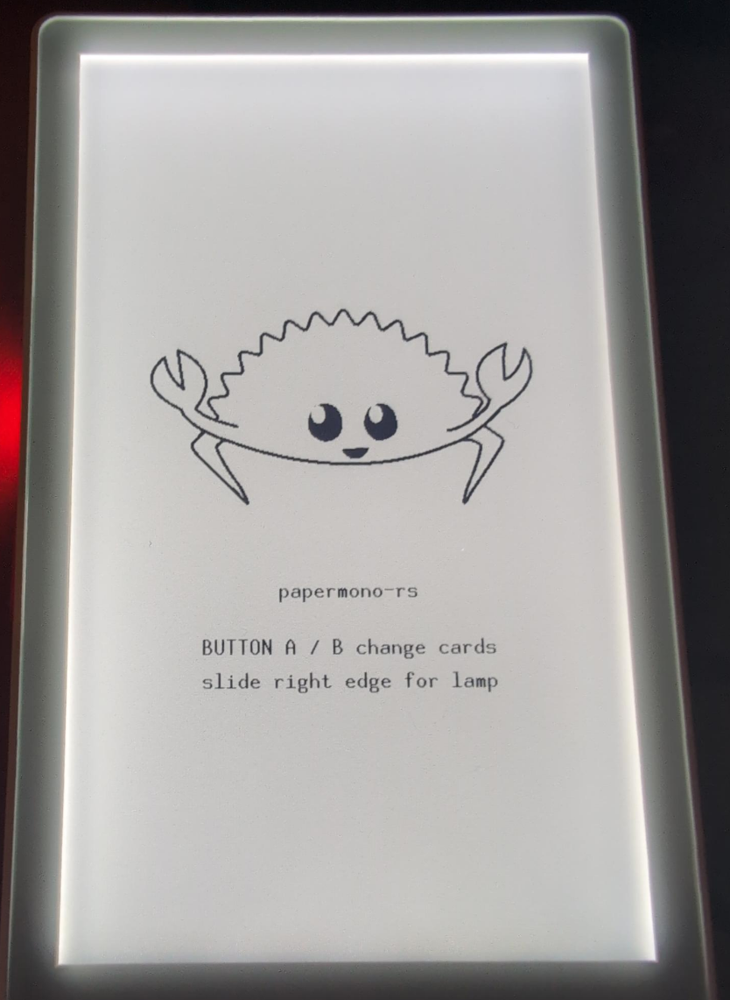

# `papermono-rs`

> Embedded Rust tooling and crates for the
> [M5Stack PaperMono](https://docs.m5stack.com/en/core/PaperMono)
> and
> [PaperMono-Lite](https://docs.m5stack.com/en/core/PaperMono-Lite).

This repository is a peer of
[`sticky-rs`](https://github.com/canardleteer/sticky-rs).
The board contract and a safety-first host CLI (`cargo xtask`)
are here. Board crates:
`m5stack-papermono-lite` (`C153-Lite`, shared map) and
`m5stack-papermono` (`C153`, NFC + LoRa).
`simple-debug-fw` and `embassy-debug-fw` are workspace members,
not default-members.

- Host tools are: `cargo xtask` over `host/papermono-host`.
- **Read [docs/SAFETY.md](docs/SAFETY.md) before flashing or
  probing a unit.** A mistake can damage the panel (DC imbalance
  / invented LUTs), hang the system I2C bus (IP2315), or lose
  per-unit PHY calibration.
- [Getting started](docs/getting-started.md) (host verify, Xtensa,
  firmware install & run).
- [Snapshot HOWTO](docs/firmware-snapshot-management.md).
  Snapshot that unit before the first custom image if you care
  about PHY cal.
- [Hardware details](.agents/skills/m5stack-papermono-hardware/SKILL.md).
  Pin map, rails, SKU differences, datasheet cache.
- Open measurements:
  [not-yet-confirmed.md](docs/not-yet-confirmed.md)
  (`nyc-*`). Name PaperMono (`C153`) vs PaperMono-Lite
  (`C153-Lite`).
- Crate verdicts: [docs/CRATES.md](docs/CRATES.md).
- Other docs live in [`docs/`](./docs).
  `docs/SAFETY.md`, `docs/DATASHEETS.md`, and
  `docs/not-yet-confirmed.md` are symlinks into the hardware
  skill.

> [!IMPORTANT]
>
> Anything we have not measured on a PaperMono or PaperMono-Lite
> in hand is still official-docs intent. The backlog is
> [`nyc-*`](docs/not-yet-confirmed.md).
> **Implemented is not proven.** See the
> [tool verification ledger](docs/firmware-snapshot-management.md#tool-verification-ledger)
> before treating a command as working on a unit.

## Firmware Examples

  

- [plain](./firmware/simple-debug)
  - [quick install](./docs/getting-started.md#path-a--without-embassy-simple-debug)
- [embassy-rs](./firmware/embassy-debug)
  - [quick install](./docs/getting-started.md#path-b--with-embassy-embassy-debug)

## cargo xtask

From the repo root (`cargo xtask <subcommand>`).
`cargo xtask --help` lists flags.

Live commands take `--port` or `ESPFLASH_PORT`; if unset they
need exactly one Espressif USB-Serial/JTAG (`303a:1001`).
QinHeng `1a86:55d3` is refused. Download is a power-button hold
(~2 s until the red LED blinks), not DTR.

| Command | USB? | Summary |
| --- | --- | --- |
| `detect-connected` | no, unless `--probe` | List `303a:1001` nodes. `--probe` opens the flasher |
| `backup-factory-firmware` | live dump yes; `--import` no | Named capture under `developer-data/backups/`. Alias `backup-firmware` |
| `confirm-factory-firmware` | yes | Compare live flash to that unit's original, or `--capture SLUG` |
| `restore-factory-firmware` | yes | write-bin that unit's original or `--capture` (`--yes`). Never a full-chip erase |
| `flash-app` | yes | write-bin `--image FILE` into snapshot `factory` only. Needs a matching capture. Does not compile |
| `vet-idle-log` | no | Host-only idle grammar on a `monitor` capture |
| `build-fw` | no | Host-only. `cargo +esp` + `save-image` for `simple-debug` or `embassy-debug` |
| `ci` | no | Host-only CI gate (fmt, host clippy/test, firmware clippy, rumdl, machete, audit) |
| `monitor` | yes | USB-Serial/JTAG listen at 115200 (usbfs). After `flash-app`, short-press red |

## SKUs

| SKU | Product | Difference |
| --- | --- | --- |
| `C153` | PaperMono | ST25R3916 NFC + Stamp LoRa-1262; gray case |
| `C153-Lite` | PaperMono-Lite | No NFC, no LoRa; white case |

Shared: ESP32-S3R8, 16 MB flash, 8 MB octal PSRAM, 3.97" 480×800
SSD1677 4-gray, FT6336G, frontlight, M5PM1, M5IOE1, 1150 mAh.

## License

Sources in this repository are licensed under the MIT license. See
[LICENSE](LICENSE).

M5Stack, PaperMono, Espressif, and other product or company names
are trademarks of their respective owners. This project does not
claim those marks or their copyrights, and is not affiliated with
or endorsed by those owners.
