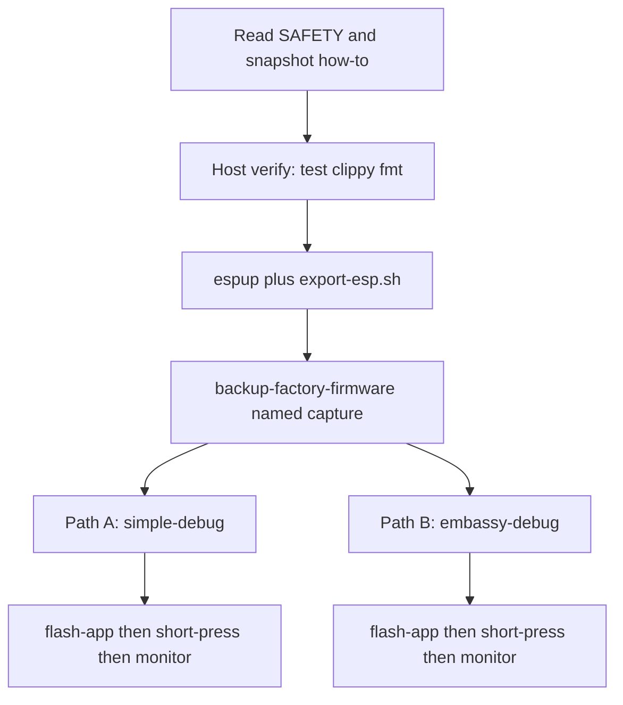

# Getting started

Fresh-start how-to for this repository: host verify, the Xtensa
toolchain, a snapshot of **your** unit, then either firmware
path.

Read [SAFETY.md](SAFETY.md) before flashing or probing. Snapshot
how-to:
[firmware-snapshot-management.md](firmware-snapshot-management.md).
What each image does lives in the firmware READMEs — do not treat
this page as a substitute.



## Four rules

In the order you are most likely to regret breaking them:

1. **Never erase the flash.** No `espflash erase-flash`, no
   full-chip erase. Snapshot that unit first if you care about
   PHY cal. ESP32-S3 RF calibration lives in NVS. Do not invent
   Sticky’s `0x90000` / 32 MB geometry. Dump length is the
   measured size (Lite: 16 MB). M5Stack publishes a factory
   restore image; that is not a license to skip a snapshot.
   Capture once with `cargo xtask backup-factory-firmware`
   before any custom image.
2. **Do not invent an e-paper waveform.** Call panel OTP only.
   After about ten partial refreshes, do a full refresh.
   Uninterrupted partials can damage the panel. Details:
   [SAFETY.md](SAFETY.md).
3. **Park IP2315 off the system I2C bus** except the gated
   charge transaction. Leaving it mounted can hang the bus,
   especially at low VBAT.
4. **Download mode is a power-button hold** (~2 s until the red
   LED blinks), not DTR on a CH343. GPIO0 and GPIO3 are
   strapping pins. GPIO45/46 are PDM, not a power latch.

Full hazard table: [SAFETY.md](SAFETY.md). Open measurements:
[not-yet-confirmed.md](not-yet-confirmed.md). Crate verdicts:
[CRATES.md](CRATES.md).

Host I/O is `cargo xtask` only. There is no Cargo `runner`, so
`cargo run` cannot flash.

## The workspace (host, no special toolchain)

```shell
cargo test --locked
cargo clippy --locked --all-targets -- -D warnings
cargo fmt --check
```

This is the default host trio for `crates/*` and the host tools:
they are host-testable, so no target hardware, cross toolchain,
or serial port is involved. Firmware packages are workspace
members but not default-members, so these commands skip them.
Do not pass `--workspace` (that pulls Xtensa). `cargo xtask ci`
is the full gate (that trio plus firmware clippy, rumdl,
machete, and audit).

## The firmware (Xtensa)

`firmware/simple-debug` and `firmware/embassy-debug` target
`xtensa-esp32s3-none-elf`, which needs the Espressif toolchain
because Xtensa is not an upstream rustc target. `simple-debug`
is blocking `esp-hal` only. `embassy-debug` uses Embassy. Build
from the **repo root** — there is no per-image
`.cargo/config.toml`.

```shell
cargo install espup --locked
espup install                       # installs the `esp` toolchain + Xtensa GCC
. $HOME/export-esp.sh               # required in every new shell
```

The result is an ELF and `save-image` payload at
`target/xtensa-esp32s3-none-elf/release-fw/simple-debug-fw` /
`simple-debug.bin` (or `embassy-debug-fw` / `embassy-debug.bin`).
A linker warning about `a LOAD segment with RWX permissions` is
expected for esp-hal images and is not a problem.

Equivalent without xtask:

```shell
cargo +esp build -p simple-debug-fw --profile release-fw --locked \
  --target xtensa-esp32s3-none-elf -Zbuild-std=core,alloc
```

### Snapshot first

Once per unit, before `flash-app`. Hold the red power button
about 2 s until it blinks, then:

```shell
cargo xtask backup-factory-firmware --name my-unit
```

`flash-app` refuses without a matching original or `--capture`.
If more than one Espressif USB-Serial/JTAG is present, set
`ESPFLASH_PORT`. Do not commit `developer-data/`.

### Path A — without Embassy (`simple-debug`)

Blocking `esp-hal` proof-of-life. CDC heartbeat and button
edges. The glass does not refresh.

```shell
. $HOME/export-esp.sh
cargo xtask build-fw simple-debug
# hold red ~2 s until blink, then:
cargo xtask flash-app \
  --image target/xtensa-esp32s3-none-elf/release-fw/simple-debug.bin \
  --yes --capture my-unit
# short-press red to leave the bootloader, then:
cargo xtask monitor
```

You should see repeating `hello` / `git` / `gpio` / `hb` lines.
Press BUTTON A or BUTTON B for `edge`. Host check on a capture:
`cargo xtask vet-idle-log --input idle-simple.log`. Envelope
and line format:
[firmware/simple-debug/README.md](../firmware/simple-debug/README.md).

### Path B — with Embassy (`embassy-debug`)

Embassy staged image. Default features are **`touch` +
`panel`**: cold boot is the splash (Ferris + `papermono-rs`).
BUTTON A / B walk splash → shapes → legend → tones →
targets. Slide the right edge for the lamp (top bright,
USB-C dim). `mic` / `radio` / `sleep` stay opt-in.

```shell
. $HOME/export-esp.sh
cargo xtask build-fw embassy-debug
# hold red ~2 s until blink, then:
cargo xtask flash-app \
  --image target/xtensa-esp32s3-none-elf/release-fw/embassy-debug.bin \
  --yes --capture my-unit
# short-press red to leave the bootloader, then:
cargo xtask monitor
```

Ctrl-C ends monitor. Do not `kill -9` that listen.

Unattended you should see `hello image=embassy-debug` and a 1 Hz
`hb`. Splash prints `scene=splash`. Host check:
`cargo xtask monitor --for 25 --output idle-embassy.log` then
`cargo xtask vet-idle-log --input idle-embassy.log --image
embassy-debug`. Cards, lamp, and CDC:
[firmware/embassy-debug/README.md](../firmware/embassy-debug/README.md).

`flash-app` writes a `.bin`; it does not compile. If the build
fails, do not flash a leftover ELF.

`monitor` needs the usbfs udev rule
([xtask.md](../.agents/skills/papermono-rs/references/xtask.md#usbfs-udev-for-monitor)).
Do not use `monitor --reset` to recapture on Lite.

## Troubleshooting

Failure modes that look like a code bug and are not:

| Symptom | Cause |
| --- | --- |
| `rustc 1.x is not supported … esp-hal` | The `esp` toolchain is older than esp-hal needs. Run `espup update` |
| `linker 'xtensa-esp32s3-elf-gcc' not found` | `. $HOME/export-esp.sh` was not sourced in this shell |
| `QinHeng` / `1a86:55d3` refused | This board is Espressif `303a:1001`, not a Sticky CH343 |
| `flash-app` wants a matching snapshot | Run `backup-factory-firmware --name …` on **this** unit first |
| Flash succeeded, glass / CDC unchanged | Flasher stayed in bootloader. Short-press red |
| `monitor` silent on stock UserDemo | Expected. Custom images print `simple-debug:` lines |
| `monitor` cannot claim usbfs | Install the udev rule, stay in `dialout`, replug |
| `cannot find module or crate xtensa_lx` | Built without the Xtensa target. Use `cargo xtask build-fw` |
| `failed to load manifest … library/std` | Incomplete `esp` `rust-src`, usually an interrupted `espup`. Reinstall |

One workspace lockfile is committed. `cargo +esp` and
`build-fw` pass `--locked`. Confirm the lockfile still matches
(compiles nothing):

```shell
cargo metadata --locked --format-version 1 --no-deps
```

## Status

The board crates are host-tested. They have **not** closed every
open measurement on silicon.

`firmware/simple-debug` cross-compiles for
`xtensa-esp32s3-none-elf`. On PaperMono-Lite it prints
`hello` / `hb` / `edge` on USB-Serial/JTAG. No panel refresh.

`firmware/embassy-debug` is a separate Embassy image (workspace
member, not a default-member). The landing image is
`touch` + `panel` (cards + lamp). PDM, radio scan, and RTC
sleep are `--features`. First SKU is Lite. PaperMono (`C153`)
USB, JEDEC, and partition table are still unmeasured.

`cargo xtask` **has** talked to a PaperMono-Lite:
`detect-connected`, `--probe`, named backup / confirm / restore,
`flash-app`, and `monitor`. A Lite result does not confirm
`C153`. Agents still do not invoke xtask unless a human
explicitly asks.

Compiling is not evidence about GPIO sequencing. A linked ELF
says the types and pin roles agree with `esp-hal`; it says
nothing about whether the panel, I2C park, or sleep is correct
on real silicon.

## Layout

| Path | What |
| --- | --- |
| [`crates/m5stack-papermono-lite`](../crates/m5stack-papermono-lite) | `C153-Lite`. Shared pin map for both SKUs |
| [`crates/m5stack-papermono`](../crates/m5stack-papermono) | `C153`. Re-exports Lite; NFC + LoRa |
| [`crates/papermono-log`](../crates/papermono-log) | Host-tested USB-Serial/JTAG line format |
| [`crates/ssd1677-otp`](../crates/ssd1677-otp) | Panel OTP sequences. No MCU LUT |
| [`crates/m5pm1`](../crates/m5pm1) | PMIC registers + PWM0 |
| [`crates/m5ioe1`](../crates/m5ioe1) | Expander banks + IP2315 gate |
| `firmware/simple-debug` | ESP32-S3 proof-of-life. Workspace member, not a default-member |
| `firmware/embassy-debug` | ESP32-S3 Embassy staged image. Same membership |
| `host/papermono-host/` | Host library: detect, backup, confirm, restore, `build-fw`, `flash-app`, monitor |
| `xtask/` | Clap front-end at the repo root (`cargo xtask`) |
| `developer-data/` | Gitignored. Sealed snapshots in `developer-data/backups/`; not in git |

Command list: [README.md](../README.md#cargo-xtask). Flag
catalog:
[`.agents/skills/papermono-rs/references/xtask.md`](../.agents/skills/papermono-rs/references/xtask.md).

## Hardware documentation

The board contract lives in
[`.agents/skills/m5stack-papermono-hardware/`](../.agents/skills/m5stack-papermono-hardware/SKILL.md):
pin and bus map, power sequencing, display and touch geometry,
SKU differences, flashing, datasheet catalog, plus a
measurement backlog. When sources disagree, the skill user
weighs them. Observed hardware on this product outranks
official board docs and chip datasheets, which outrank
third-party firmware.

Datasheet catalog (symlink into that skill):
[DATASHEETS.md](DATASHEETS.md). This repository’s host tools
and crate layout:
[`.agents/skills/papermono-rs/`](../.agents/skills/papermono-rs/SKILL.md).
