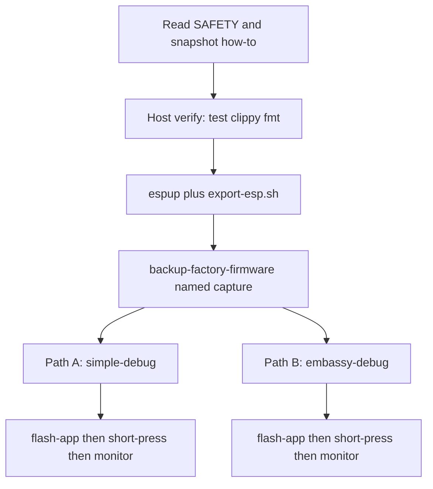

# Getting started

Fresh-start guide for this repository: verifying host tooling, configuring
the Xtensa toolchain, creating a device snapshot, and running firmware images.

Read [SAFETY.md](SAFETY.md) before flashing or probing. Snapshot instructions
appear in [firmware-snapshot-management.md](firmware-snapshot-management.md).
Detailed operational contracts for each firmware image reside in their
respective directories.



## Four rules

In the order you are most likely to regret breaking them:

1. **Preserve the factory image before flashing.** Avoid full-chip erase commands
   or `espflash erase-flash`. While the ESP32-S3 MAC is in factory eFuses and
   ESP-IDF will auto-calibrate RF into NVS if erased, backing up the flash
   preserves the stock partition geometry, factory demo image, and device state
   without needing vendor downloads. Dump the measured flash length (16 MB on
   Lite hardware) with `cargo xtask backup-factory-firmware` before flashing.
2. **Do not invent an e-paper waveform.** Use panel OTP sequences directly.
   Execute a full refresh after roughly ten partial refreshes to avoid
   permanent ghosting. Full constraints appear in [SAFETY.md](SAFETY.md).
3. **Park IP2315 off the system I2C bus except during active charge transactions.**
   Leaving the battery controller on the bus risks locking I2C communication at
   low battery voltages.
4. **Download mode is entered via a power-button hold.** Hold the power button for
   approximately two seconds until the red indicator flashes. GPIO0 and GPIO3
   serve as reset strapping pins. GPIO45 and GPIO46 carry PDM microphone signals
   rather than power latch controls.

The hazard summary is documented in [SAFETY.md](SAFETY.md). Open measurements
are tracked in [not-yet-confirmed.md](not-yet-confirmed.md), with crate
evaluations in [CRATES.md](CRATES.md).

All host-side device interaction runs exclusively through `cargo xtask`.

## The workspace (host, no special toolchain)

```shell
cargo test --locked
cargo clippy --locked --all-targets -- -D warnings
cargo fmt --check
```

These commands exercise `crates/*` and host tooling on standard host rustc
without requiring embedded targets or attached hardware. Firmware targets are
excluded from the default members list to prevent cross-compilation errors
during host testing. Running `cargo xtask ci` executes the complete validation
suite, incorporating code formatting, clippy passes, linters, and dependency
audits.

## The firmware (Xtensa)

`firmware/simple-debug` and `firmware/embassy-debug` target
`xtensa-esp32s3-none-elf`, requiring the Espressif toolchain fork. While
`simple-debug` employs blocking `esp-hal` primitives, `embassy-debug` runs the
async Embassy runtime. Build commands execute from the repository root:

```shell
cargo install espup --locked
espup install
. $HOME/export-esp.sh
```

Build outputs are saved to `target/xtensa-esp32s3-none-elf/release-fw/`
alongside binary image payloads. Linker notices regarding read-write-execute
segments represent normal `esp-hal` behavior.

Manual builds without xtask can be performed with:

```shell
cargo +esp build -p simple-debug-fw --profile release-fw --locked \
  --target xtensa-esp32s3-none-elf -Zbuild-std=core,alloc
```

### Snapshot first

Create a backup once per device before invoking `flash-app`. Hold the red power
button for two seconds until it blinks, then execute:

```shell
# Save as unit original (recommended for factory stock):
cargo xtask backup-factory-firmware --as-original

# Or save as a named capture:
cargo xtask backup-factory-firmware --name my-unit
```

`flash-app` checks for an existing original or named capture before proceeding.
If multiple Espressif devices are connected, specify the target port with
`ESPFLASH_PORT`.

### Path A — without Embassy (`simple-debug`)

`simple-debug` provides proof-of-life verification using blocking `esp-hal`
routines. It streams a heartbeat and button events over the CDC interface
while keeping the display inactive. The core firmware serves as a clean Lite
baseline by default; passing `--features c153` activates Full-model identity
and compile-time pin verification.

```shell
. $HOME/export-esp.sh

# Build for PaperMono-Lite (or Full hardware with Lite baseline features):
cargo xtask build-fw simple-debug

# Or build with PaperMono Full SKU (C153) features:
cargo xtask build-fw simple-debug --features c153

cargo xtask flash-app \
  --image target/xtensa-esp32s3-none-elf/release-fw/simple-debug.bin \
  --yes
cargo xtask monitor
```

If you saved a named capture (`--name my-unit`) instead of `--as-original`,
pass `--capture my-unit` to `flash-app`.

The output stream contains repeating `hello`, `git`, `gpio`, and `hb` lines.
Pressing buttons produces instantaneous edge notifications. For logging
analysis, run `cargo xtask vet-idle-log --input idle-simple.log`. Details on
message structure are covered in
[firmware/simple-debug/README.md](../firmware/simple-debug/README.md).

### Path B — with Embassy (`embassy-debug`)

`embassy-debug` activates async board drivers. Standard builds enable touch
interaction, panel rendering, orientation tracking, and button sleep/wake,
presenting a Ferris splash on boot and allowing navigation across test cards
with hardware buttons. Frontlight brightness and buzzer volume adjust via edge
swipes, and touch buttons provide immediate visual highlight feedback.

The core firmware operates as a Lite baseline by default. Adding `--features c153`
activates PaperMono Full SKU (`C153`) board identity and discovery diagnostics
for the ST25R3916 NFC controller and Stamp LoRa-1262 (SX1262) transceiver.

```shell
. $HOME/export-esp.sh

# Build for PaperMono-Lite (or Full hardware with Lite baseline features):
cargo xtask build-fw embassy-debug

# Or build with PaperMono Full SKU (C153) features:
cargo xtask build-fw embassy-debug --features c153

cargo xtask flash-app \
  --image target/xtensa-esp32s3-none-elf/release-fw/embassy-debug.bin \
  --yes
cargo xtask monitor
```

If you saved a named capture (`--name my-unit`) instead of `--as-original`,
pass `--capture my-unit` to `flash-app`.

Stop monitoring with standard interrupt signals (Ctrl-C). Unattended operation
generates periodic heartbeats and splash events. Detailed card operations and
CDC definitions are described in
[firmware/embassy-debug/README.md](../firmware/embassy-debug/README.md).

Monitoring requires proper usbfs udev permissions. Recapturing over native CDC
should rely on manual reset rather than serial control lines.

## Troubleshooting

Common configuration issues:

| Symptom | Cause |
| --- | --- |
| `rustc 1.x is not supported … esp-hal` | The installed toolchain is outdated. Run `espup update` |
| `linker 'xtensa-esp32s3-elf-gcc' not found` | The environment file was not sourced. Run `. $HOME/export-esp.sh` |
| `QinHeng` / `1a86:55d3` refused | The connected device is not an Espressif native USB node |
| `flash-app` wants a matching snapshot | An original or snapshot capture must be saved for this device first |
| Flash succeeded, glass / CDC unchanged | The target remained in bootloader mode; short-press the power button |
| `monitor` silent on stock factory demo | Official factory demo firmware ([M5PaperMono-UserDemo](https://github.com/m5stack/M5PaperMono-UserDemo)) does not output `simple-debug:` text lines |
| `monitor` cannot claim usbfs | Confirm udev rules are active and your user belongs to dialout |
| `cannot find module or crate xtensa_lx` | The active target is not Xtensa; invoke builds via `cargo xtask build-fw` |
| `failed to load manifest … library/std` | The toolchain installation was incomplete; reinstall via espup |

Verify workspace dependencies against the locked configuration:

```shell
cargo metadata --locked --format-version 1 --no-deps
```

## Cross-model flashing (Full vs Lite)

PaperMono (`C153`) and PaperMono-Lite (`C153-Lite`) share common electronics:
ESP32-S3R8 SoC, 16 MB flash, SSD1677 OTP e-paper panel, FT6336G touch controller,
M5PM1 PMIC, M5IOE1 expander, BMI270 IMU, RX8130CE RTC, buttons, buzzer, and
frontlight PWM boost.

- **Flashing Lite firmware to Full (`C153`) hardware**: Safe. All shared peripherals
  function normally. Full-model peripherals (NFC and LoRa) remain safely unpowered
  because their power gates (M5IOE1 `PYG4` and M5PM1 `G2`) default to unasserted.
- **Flashing Full firmware to Lite (`C153-Lite`) hardware**: Safe. Unpopulated
  pins are toggled without electrical load; I2C `0x50` and SPI3 safely NAK, and
  firmware gracefully falls back.
- **Why host-side refusal is not feasible in download mode**: Both models share
  the identical ESP32-S3 USB VID:PID (`303a:1001`), identical product strings, and
  ROM download mode does not expose board-level SKU metadata. Board model
  differentiation is performed at runtime in firmware by probing the I2C peripheral
  roster.

## Status

Board support crates are validated with host unit tests. Target measurements on
physical hardware continue to be cataloged as hardware samples become
available. PaperMono-Lite (`C153-Lite`) hardware has established the baseline
for the display, touch controller, frontlight, buzzer, IMU, battery, and
wireless cards.

Discovery preparation for PaperMono (`C153`) is active on the
`feat/papermono-discovery` branch. Safe host-tested driver primitives for
ST25R3916 NFC and Stamp LoRa-1262 (SX1262) are implemented. The factory backup
of the physical `C153` hardware (`id-e3e5915e`) confirmed identical 16 MB
flash size, stock partition table geometry, and factory demo version
(`c78f6c5-dirty`) matching the PaperMono-Lite baseline.

`firmware/simple-debug` compiles for `xtensa-esp32s3-none-elf`, streaming
identification and button telemetry across USB-Serial/JTAG on PaperMono devices.

`firmware/embassy-debug` targets the async Embassy runtime as a distinct
workspace member package. The standard image includes touch digitizer and
e-paper support, while microphone sampling, wireless scanning, and low-power
sleep modes remain opt-in features.

Host commands in `cargo xtask` have been verified against both PaperMono-Lite
and PaperMono hardware for identification, backup extraction, and serial
monitoring.

## Layout

| Path | Purpose |
| --- | --- |
| [`crates/m5stack-papermono-lite`](../crates/m5stack-papermono-lite) | Shared board pin definitions across PaperMono models |
| [`crates/m5stack-papermono`](../crates/m5stack-papermono) | Peripheral definitions specific to the standard PaperMono SKU |
| [`crates/papermono-log`](../crates/papermono-log) | Host-tested USB-Serial/JTAG line formatting parser |
| [`crates/ssd1677-otp`](../crates/ssd1677-otp) | SSD1677 e-paper controller OTP driver |
| [`crates/m5pm1`](../crates/m5pm1) | M5PM1 power controller register definitions and PWM helpers |
| [`crates/m5ioe1`](../crates/m5ioe1) | M5IOE1 expander and charger bus isolation gate |
| `firmware/simple-debug` | Blocking test application package for early bring-up |
| `firmware/embassy-debug` | Async Embassy demonstration image with interactive cards |
| `host/papermono-host/` | Host automation library covering flashing and device monitoring |
| `xtask/` | CLI entry point dispatching host subcommands |
| `developer-data/` | Gitignored directory holding per-device firmware snapshots |

Command summaries appear in the root [README.md](../README.md#cargo-xtask), with
detailed flag specifications located in the project documentation.

## Hardware documentation

Comprehensive hardware details reside in the hardware documentation collection,
detailing power topologies, display timings, digitizer mappings, SKU
variations, and verified component measurements. Datasheet citations and
peripheral registers are referenced in [DATASHEETS.md](DATASHEETS.md).
